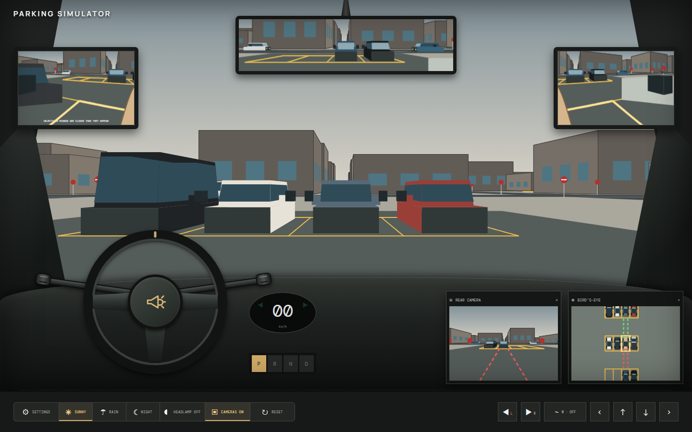

# Parking Simulator

Learn the feel of parking from the driver's seat with a multi-view driving
simulator built for practice.

## Run locally

Run `npm run dev`, then open **http://127.0.0.1:4819/**. The explicit address
avoids accidentally opening another development server through `localhost`.

## [Play Parking Simulator](https://chris-kc-cheng.github.io/parking-simulator/)

## Explore the city

Drive one continuous city map with a simple orthogonal street grid inspired by
Berczy Village in Markham, Ontario. Every road is straight and every junction is
a four-way `+` intersection, with no diagonal roads or roundabouts. Stop signs mark intersection corners,
multiple marked parking lots and curbside parking add denser practice areas, and
the highlighted bay gives you a destination for front-in or
back-in practice.

Live traffic keeps to the right of the physical white center line and begins
braking early to leave three car lengths between its bumper and your vehicle.
At intersections, the expanded traffic population can continue straight or choose
a left or right turn, then settles into the correct right-hand lane under Canadian
drive-on-right rules. Non-parking traffic remains part of the live movement system;
if a traffic car stays boxed in for three seconds, it is restarted on its moving route
instead of becoming a permanent stopped street obstacle.
The cross street directly ahead of the learner's starting parking bay also has
eastbound and westbound live traffic, making movement visible immediately.
The windshield renders at 30 FPS while mirrors and camera panels refresh at
12 FPS, leaving enough frame time for continuous traffic physics and steering.
Moving traffic follows the car ahead with a graduated 18-metre braking zone,
preventing collision-box deadlocks while preserving a safe stopped gap.
Every view projects the same map markings, so the windshield, mirrors, rear camera,
and bird's-eye camera always agree. Buildings are solid obstacles,
so use the connected road network to drive around each block.

The neighbourhood structure is a scaled driving interpretation rather than a
survey-accurate navigation map. It was informed by the [City of Markham official
plan](https://www.markham.ca/economic-development-business/planning-development-services/official-plan),
the [City street guide](https://www.markham.ca/about-the-city-of-markham/city-hall/interactive-maps-applications),
and [OpenStreetMap](https://www.openstreetmap.org/#map=15/43.8914/-79.3038).

## Drive

| Action | Keyboard | On-screen control |
| --- | --- | --- |
| Steer left or right | <kbd>←</kbd> / <kbd>→</kbd> | Hold the left or right arrow |
| Drive forward / brake while reversing | <kbd>↑</kbd> | Hold the **↑** button |
| Reverse / brake while driving forward | <kbd>↓</kbd> | Hold the **↓** button |
| Select a gear | — | Choose **P**, **R**, **N**, or **D** on the dashboard |
| Sound the horn | — | Press **Horn** in the centre of the steering wheel |
| Left turn signal | <kbd>L</kbd> | Press **L** in the bottom control bar |
| Right turn signal | <kbd>R</kbd> | Press **R** in the bottom control bar |
| Toggle slow windshield wipers | <kbd>W</kbd> | Press **Wiper** in the bottom control bar |
| Change weather | — | Choose **Sunny**, **Rainy**, or **Night** in the bottom-left toggle group |
| Toggle the learner car headlamps | — | Press **Headlamp On/Off** in the bottom-left group |
| Toggle both camera panels | — | Press **Cameras On/Off** in the bottom-left group |

Hold the accelerator to reach the simulator's 100 km/h maximum. The speed display
and steering wheel move with the car. The gear selector is vertically aligned
below the speedometer. Select **Reset** at any time to return to
the highlighted yellow parking bay, where every drive begins.
Pressing the pedal opposite the current direction applies an 8 m/s² service brake,
which is substantially stronger than the 3.2 m/s² forward or 2.2 m/s² reverse
acceleration. The transmission changes direction only after the car stops.

## Use the driving aids

Watch the side mirrors and rear-view mirror as you maneuver. The rear camera
includes parking guides, while the bird's-eye camera helps you judge the car's
position between the lines. Drag the mirrors and camera panels to move them;
camera panels can also be hidden and restored.
Use the combined camera button to disable or restore the rear and bird's-eye
panels together.

Every parked and moving vehicle includes physical side-mirror solids attached
to its body. The same geometry is rendered in the windshield and bird's-eye
view and participates in vehicle clearance checks. Perspective rendering culls
the vehicle's hidden faces, far-side mirror, and rear-facing headlamp fixtures.
The learner car's headlamps are off by default and can be toggled from the
bottom control bar. Moving street traffic keeps its headlamps on, while parked
vehicles keep their lamps off. These world-space light cones brighten road
surfaces, vehicle bodies, and building faces they physically reach, with stronger
and longer illumination at night. Soft cone edges and distance falloff diffuse
the light across 3D surfaces rather than treating it as a flat road decal. The
beam grows substantially wider with distance while successive lateral and
longitudinal bands become dimmer.

Open the settings button at the bottom left to adjust the mirror fisheye and camera field of view.
Touch controls are available automatically on phones and tablets.
In rainy weather, droplets appear at random positions across the windshield and
remain on the glass while sliding toward the windshield's
bottom unless one of the two overlapping, full-sweep wipers physically crosses
them. Continuous blade-path detection prevents a fast wiper from skipping over
drops, and drops touching a resting blade clear as well. Wiper speed cycles through
off and slow, with matching motor sounds.
